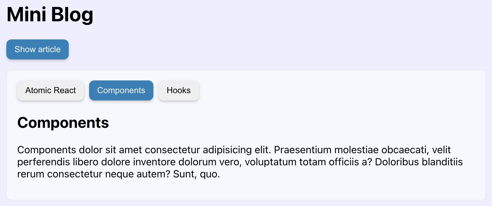

# ⚛️ React Master - Mini blog: État dérivé (Exercice)

## Sommaire

<!-- no toc -->
-   [Notions de l'exercice](#notions-de-lexercice)
-   [Consignes](#consignes)
-   [Correction](#correction)

## Notions de l'exercice

-   Division de l'interface en composants
-   Les `props`
-   Le `state`
-   `PropTypes`
-   État dérivé

## Consignes

Pour réaliser cet exercice, tu vas devoir suivre les instructions suivantes:

Tu peux taper la commande suivante dans ton terminal:

```bash
git clone git@github.com:Atomic-React/react-master-mini-blog.git
```

Ensuite, rends toi dans le dossier avec la commande suivante:

```bash
cd react-master-mini-blog
```

Accède à la branche de l'exercice en exécutant la commande:

```bash
git switch ex03/exercise
```

Puis installes les dépendances avec la commande:

```bash
npm install
```

Tu peux maintenant te rendre sur l'URL <http://localhost:5173>. Tu verra que la page est au même état qu'à la fin de la correction du dernier exercice.

Dans cet exercice, tu vas devoir créer et intégrer des composants à partir de zéro.

**Penses à typer les `props` de tes composants avec `PropTypes`.**

Tu dois réaliser, en dessous des éléments existants, un système d'onglets (_"tabs"_ en anglais) permettant d'afficher différents articles:



Utilise ce tableau pour le titre des onglets et le contenu des articles:

```jsx
const tabs = [
	{
		id: 1,
		title: 'Atomic React',
		content: <Article title="Atomic React">
			<p>
				Atomic React dolor sit amet consectetur adipisicing elit. Praesentium molestiae obcaecati, velit perferendis libero dolore inventore dolorum vero, voluptatum totam officiis a? Doloribus blanditiis rerum consectetur neque autem? Sunt, quo.
			</p>
		</Article>,
	},
	{
		id: 2,
		title: 'Components',
		content: <Article title="Components">
			<p>
				Components dolor sit amet consectetur adipisicing elit. Praesentium molestiae obcaecati, velit perferendis libero dolore inventore dolorum vero, voluptatum totam officiis a? Doloribus blanditiis rerum consectetur neque autem? Sunt, quo.
			</p>
		</Article>,
	},
	{
		id: 3,
		title: 'Hooks',
		content: <Article title="Hooks">
			<p>
				Hooks dolor sit amet consectetur adipisicing elit. Praesentium molestiae obcaecati, velit perferendis libero dolore inventore dolorum vero, voluptatum totam officiis a? Doloribus blanditiis rerum consectetur neque autem? Sunt, quo.
			</p>
		</Article>,
	},
];
```

Le fichier `index.css` a été mis à jour avec des nouvelles classes, notamment une classe `btn--light` pour afficher les boutons en gris clair par défaut.

Tu remarques que le bouton de l'article actuellement visionné est en bleu.

L'article qui doit être affiché par défaut, c'est à dire au chargement de la page, doit être le deuxième.

Le numéro de l'article affiché par défaut doit être personnalisable. C'est à dire qu'en tant que développeur, si j'utilises ton composants d'onglets, je dois être capable via une `props` de choisir le numéro de l'article que je souhaite voir s'afficher par défaut.

Renseignes-toi sur les états dérivés (_"derived state"_ en anglais), cela peut t'être utile pour cet exercice.

Penses aux cas particuliers:

-   Que se passe-t-il si on ne défini pas de numéro d'article à afficher par défaut ?
-   Que se passe-t-il si on ne défini pas de contenu à afficher pour les articles ?
-   Que se passe-t-il si le tableau `tabs` fourni plus haut est vide ?

À toi de repérer ces différents cas et de les traiter de la façon dont il semble bon de le faire.

Bon courage ! 💪

## Correction

Tu peux consulter la correction écrite ici: <https://github.com/Atomic-React/react-master-mini-blog/tree/ex03/correction#correction>

Ou suivre la correction en vidéo ici: _Bientôt disponible_
